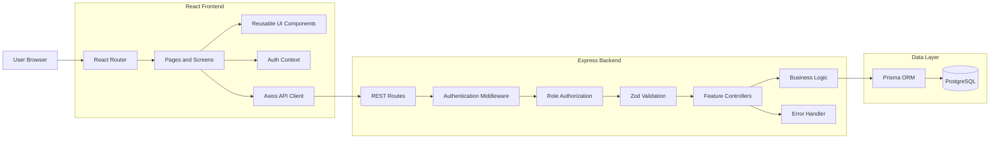
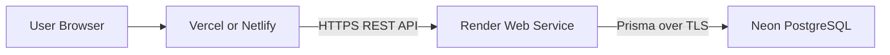

# High-Level Design

## 1. System Overview

DevFlow is a web-based monolithic full-stack application consisting of:

1. A React frontend.
2. An Express/Node.js backend API.
3. A PostgreSQL database accessed through Prisma ORM.
4. A browser-based authentication session using HTTP-only cookies.
5. Optional future integrations such as GitHub and email services.

The frontend communicates with the backend using REST APIs. The backend authenticates users, validates requests, enforces role-based permissions, executes database operations, and returns JSON responses.

## 2. High-Level Architecture



## 3. Main Components

### 3.1 React frontend

Responsibilities:

- Render authentication pages.
- Render team, project, member, task, invite, and review screens.
- Manage local UI state.
- Submit forms.
- Display loading, success, and error states.
- Control browser navigation.
- Hide actions that the current role cannot normally use.

The frontend is not the final security authority. The backend independently validates identity, membership, role, and resource ownership.

### 3.2 Axios API client

Responsibilities:

- Set the API base URL.
- Send HTTP-only cookies with `withCredentials`.
- Provide a single API client for frontend requests.
- Standardize API access across feature modules.

### 3.3 Authentication context

Responsibilities:

- Store the current user in frontend state.
- Check `/api/auth/me` when the application starts.
- Provide login, registration, and logout functions.
- Control protected-route rendering.
- Display an authentication loading state.

### 3.4 Express application

Responsibilities:

- Configure middleware.
- Configure CORS.
- Configure security headers.
- Parse JSON requests.
- Mount feature routers.
- Expose health endpoints.
- Process errors centrally.

### 3.5 Authentication middleware

Responsibilities:

1. Read the HTTP-only cookie.
2. Verify the JWT.
3. Load the corresponding user.
4. Attach the user to `req.user`.
5. Reject missing or invalid sessions.

### 3.6 Team authorization middleware

Responsibilities:

1. Read the requested team ID.
2. Find an active membership for the current user.
3. Check membership expiry.
4. Attach membership details to `req.membership`.
5. Reject users outside the team.

### 3.7 Project/task authorization middleware

Responsibilities:

- Load the requested project or task.
- Resolve its parent team.
- Check the authenticated user’s active membership.
- Attach the resource and membership to the request.
- Prevent object-level authorization failures.

### 3.8 Prisma and PostgreSQL

Responsibilities:

- Persist application data.
- Enforce primary keys and foreign keys.
- Support relational queries.
- Support transactions for multi-record operations.
- Apply version-controlled migrations.

## 4. Deployment Architecture



## 5. Request Flow

### Example: Loading a project

```text
1. User opens /projects/:projectId.
2. React Router renders ProjectPage.
3. ProjectPage extracts projectId from route params.
4. Axios sends GET /api/projects/:projectId.
5. Express receives the request.
6. Authentication middleware validates the cookie.
7. Project-access middleware loads the project.
8. Membership middleware checks the user’s team access.
9. Controller loads project data using Prisma.
10. PostgreSQL returns project data.
11. Express returns JSON.
12. React stores the response in state.
13. The project page renders.
```

## 6. Request Flow: Creating a Task

```text
1. Owner/Admin opens Create Task.
2. Frontend loads active team members.
3. User enters task data.
4. Frontend sends POST /api/projects/:projectId/tasks.
5. Backend authenticates the user.
6. Backend checks project access.
7. Backend checks Owner/Admin role.
8. Zod validates the request.
9. Backend confirms assignees and reviewers belong to the team.
10. Prisma transaction creates the task.
11. Prisma transaction creates assignee records.
12. Prisma transaction creates reviewer records.
13. Prisma transaction creates TASK_CREATED activity.
14. Transaction commits.
15. API returns the created task.
16. Frontend updates the board and displays a success notification.
```

## 7. Request Flow: Review Workflow

```text
Developer
    │
    │ Submit task
    ▼
IN_REVIEW
    │
    ├── Reviewer approves
    │       ▼
    │    APPROVED
    │       │
    │       └── Owner/Admin completes
    │                    ▼
    │                 COMPLETED
    │
    └── Reviewer requests changes
            ▼
      CHANGES_REQUESTED
            │
            └── Developer fixes and resubmits
                         ▼
                      IN_REVIEW
```

## 8. Security Architecture

### Authentication

- Passwords are hashed with bcrypt.
- JWTs are signed with a server-side secret.
- JWTs are stored in HTTP-only cookies.
- Production cookies use HTTPS and secure cross-site settings.

### Authorization

- Default deny for protected resources.
- Active team membership required.
- Role permission checked on the server.
- Project and task team ownership verified.
- Temporary memberships checked for expiry.

### Input security

- Request bodies are validated with Zod.
- Route parameters are validated.
- Untrusted input is not used directly in database queries without validation.
- Rate limiting protects authentication endpoints.
- Helmet sets security headers.

### Invite security

- Invite tokens are generated using cryptographically secure random bytes.
- Only token hashes are stored.
- Tokens expire.
- Tokens can have maximum-use limits.
- Reuse of active memberships is rejected.

## 9. Scalability Considerations

The initial application uses a modular monolith. This is appropriate for the MVP because:

- It keeps deployment simple.
- All features share consistent authentication and database access.
- The code is separated by route/controller/middleware modules.
- The system can later split high-volume functions into services if needed.

Potential future scaling improvements:

- Add Redis for caching and rate limiting.
- Add background jobs for email delivery.
- Add WebSockets for real-time updates.
- Add a notification service.
- Add database indexes for frequent team/task queries.
- Add object storage for attachments.
- Add a dedicated GitHub integration worker.

## 10. Availability and Observability

The backend exposes:

```text
GET /api/health
GET /api/health/ready
```

The first confirms that the Express process is running. The second confirms that the application can connect to PostgreSQL.

Future observability improvements:

- Structured JSON logs.
- Request correlation IDs.
- Error reporting through Sentry.
- Deployment health monitoring.
- Database performance monitoring.

## 11. Design Decisions

### PostgreSQL instead of MongoDB

DevFlow contains strongly related data:

- Users belong to teams.
- Teams contain projects.
- Projects contain tasks.
- Tasks have assignees, reviewers, reviews, and activity.
- Invitations connect users to teams.

PostgreSQL provides strong relational constraints and clear many-to-many relationships.

### REST instead of GraphQL

REST was selected because:

- The resources are clear.
- The project has predictable CRUD endpoints.
- It is easier to document and test with Postman.
- It demonstrates practical HTTP status-code usage.

### Modular monolith instead of microservices

A modular monolith keeps the project understandable and easier to deploy while preserving feature boundaries in routes, controllers, middleware, and services.

## 12. Risks and Mitigations

| Risk | Mitigation |
|---|---|
| Unauthorized team access | Server-side membership checks |
| Invalid role actions | Role authorization middleware |
| Invite token theft | Store only token hashes and use expiry |
| Database partial writes | Prisma transactions |
| Frontend crash | React Error Boundary |
| Production cookie failure | HTTPS, secure cookies, correct CORS |
| Long task board layout | Horizontal responsive scrolling |
| Stale frontend data | Reload related data after mutations |